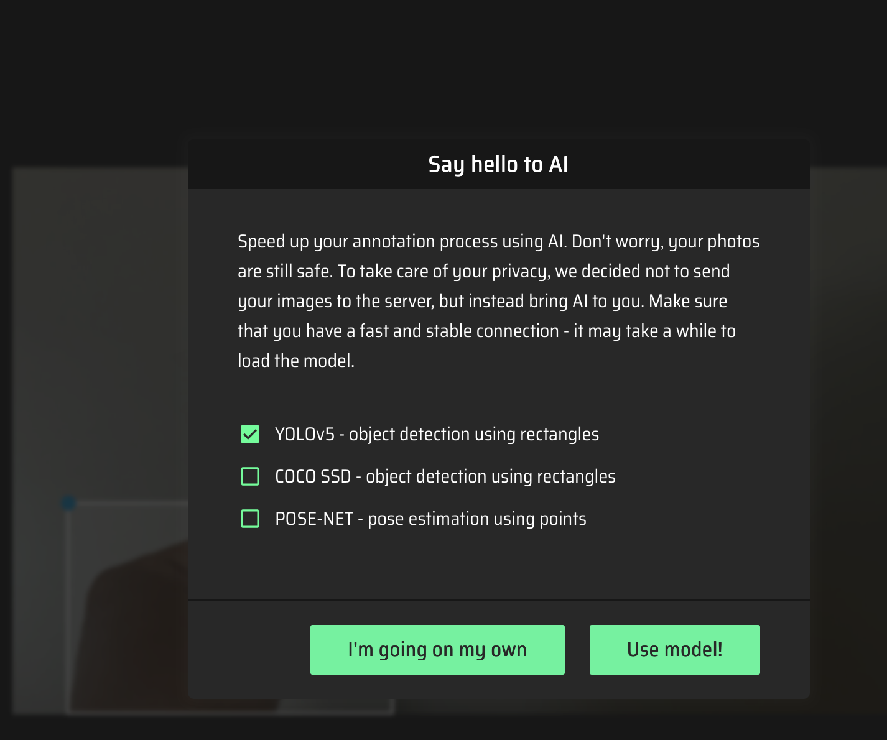
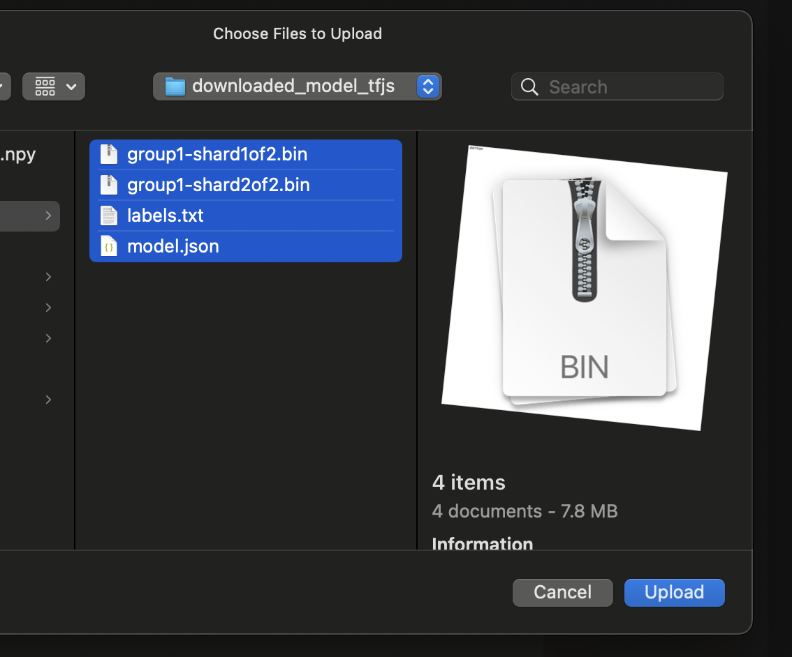
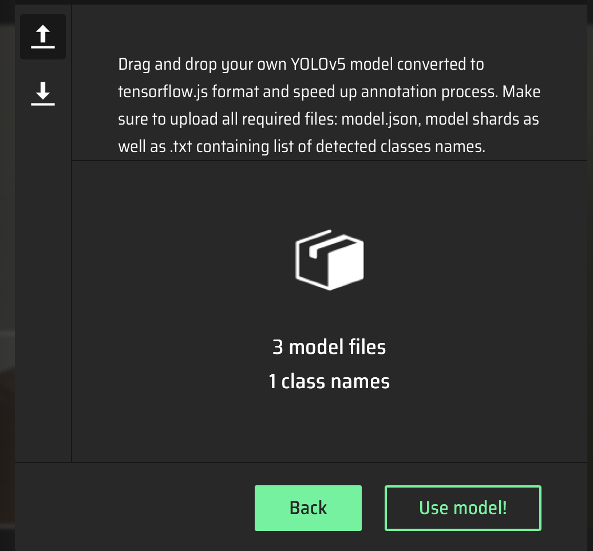
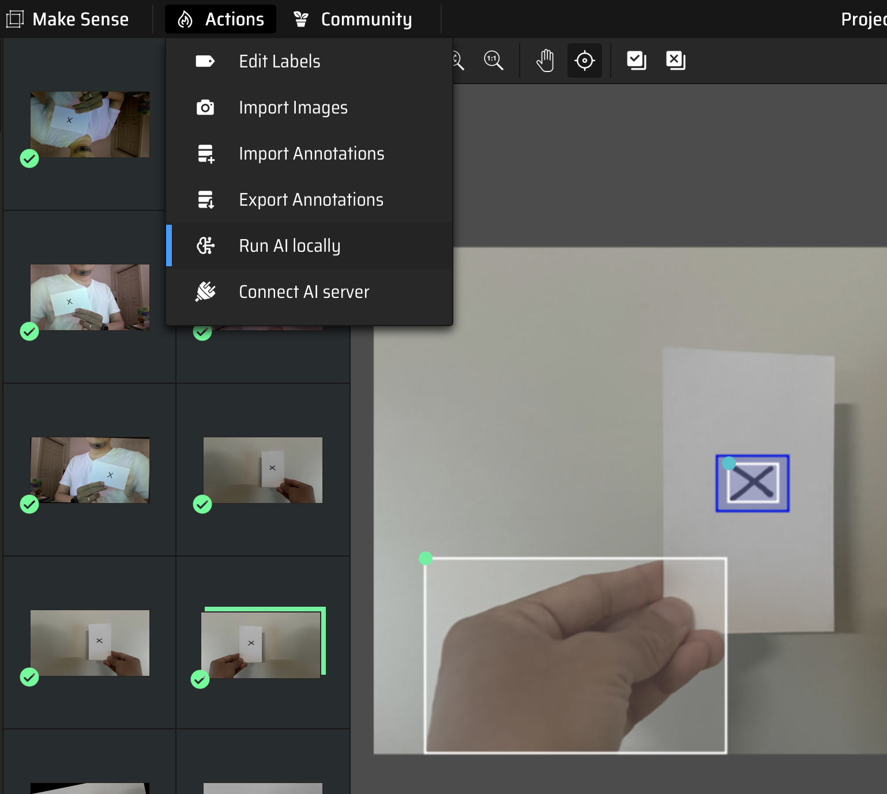

# Setup Python 3.11.13 

```
brew install pyenv
brew install pyenv-virtualenv

pyenv install 3.11.13
pyenv virtualenv 3.11.13 py3.11
```

# Load Python 3.11 env

```
eval "$(pyenv init -)"
eval "$(pyenv virtualenv-init -)"
```

```
pyenv activate py3.11
```

# Install YOLOv5

```
pip install --upgrade pip
git clone https://github.com/ultralytics/yolov5
cd yolov5
```

# Install Tensorflow and Tensorflow.js

```
pip install -r requirements.txt
pip install tensorflow==2.13.1 tensorflowjs==4.22.0
```

# Save YOLOv5 model to Tensorflow saved model

```
from ultralytics import YOLO

# Load YOLOv5 model
model = YOLO('yolov5s.pt')  # or your custom model

# Export to TensorFlow SavedModel format
model.export(format='saved_model')
```


# Convert it to tfjs model

```
# Convert to TensorFlow.js format
tensorflowjs_converter \
    --input_format=tf_saved_model \
    --output_format=tfjs_graph_model \
    --signature_name=serving_default \
    --saved_model_tags=serve \
    ./yolov5s_saved_model \
    ./yolov5s_tfjs
```

# Load into Makesense.ai

* Automate the labelling





